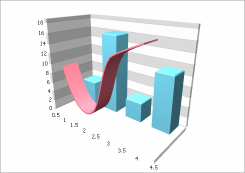

<!-- default badges list -->

<!-- default badges end -->

# Chart for WinForms - How to Combine Several Charts on a Single 3D XY-diagram

This example demonstrates how to display several series of different view types within a single diagram.

## Files to Review

* [Form1.cs](./CS/Form1.cs) (VB: [Form1.vb](./VB/Form1.vb))
* [Program.cs](./CS/Program.cs) (VB: [Program.vb](./VB/Program.vb))

## Documentation

* [3D Series Views](https://docs.devexpress.com/WindowsForms/2961/controls-and-libraries/chart-control/series-views/3d-series-views?v=23.2)
<!-- feedback -->
## Does this example address your development requirements/objectives?

 

(you will be redirected to DevExpress.com to submit your response)
<!-- feedback end -->
